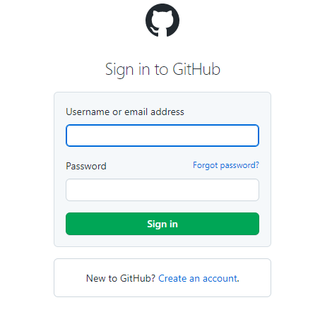
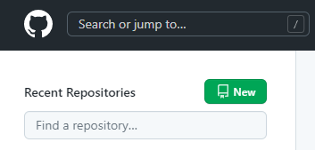
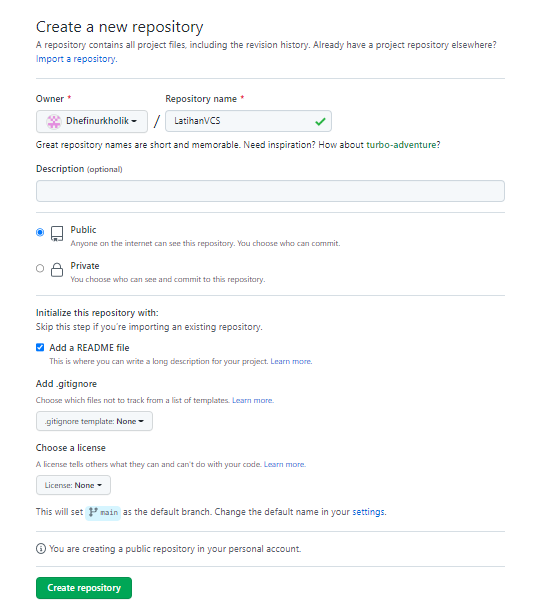
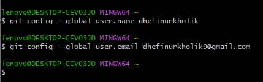
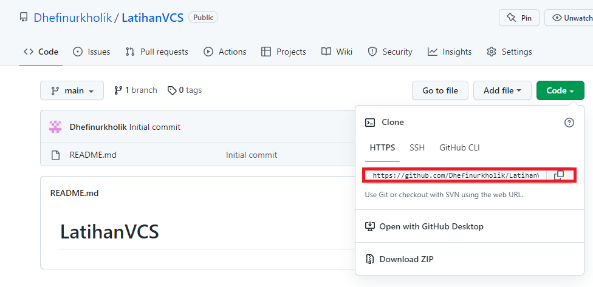
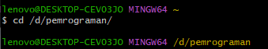
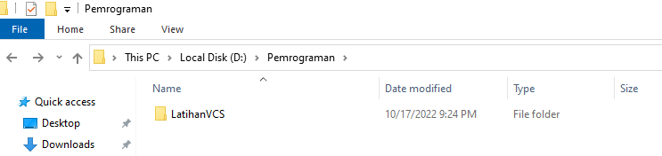
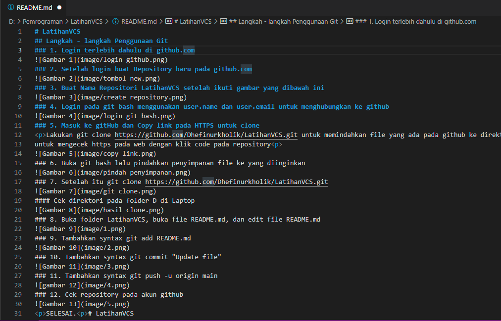

# LatihanVCS
## Langkah - langkah Penggunaan Git
### 1. Login terlebih dahulu di github.com

### 2. Setelah login buat Repository baru pada github.com

### 3. Buat Nama Repositori LatihanVCS setelah ikuti gambar yang dibawah ini

### 4. Login pada git bash menggunakan user.name dan user.email untuk menghubungkan ke github

### 5. Masuk ke gitHub dan Copy link pada HTTPS untuk clone

Lakukan git clone https://github.com/Dhefinurkholik/LatihanVCS.git untuk memindahkan file yang ada pada github ke direktori D
untuk mengecek https pada web dengan klik code pada repository

### 6. Buka git bash lalu pindahkan penyimpanan file ke yang diinginkan

### 7. Setelah itu git clone https://github.com/Dhefinurkholik/LatihanVCS.git

#### Cek direktori pada folder D di Laptop

### 8. Buka folder LatihanVCS, buka file README.md, dan edit file README.md 

### 9. Tambahkan syntax git add README.md

### 10. Tambahkan syntax git commit "Update file"

### 11. Tambahkan syntax git push -u origin main

### 12. Cek repository pada akun github

SELESAI.
# LatihanVCS